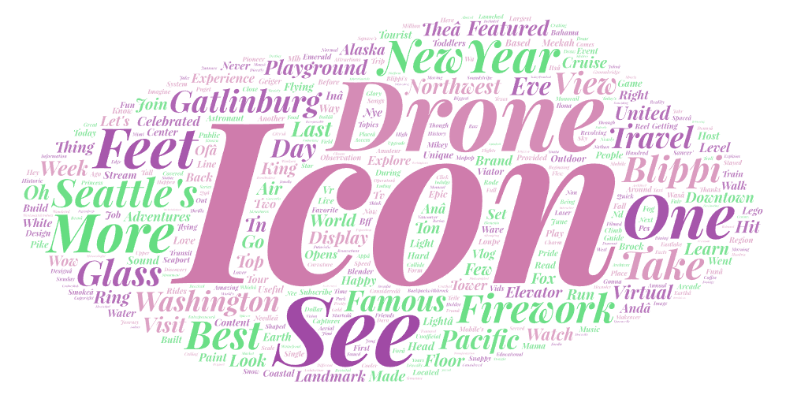
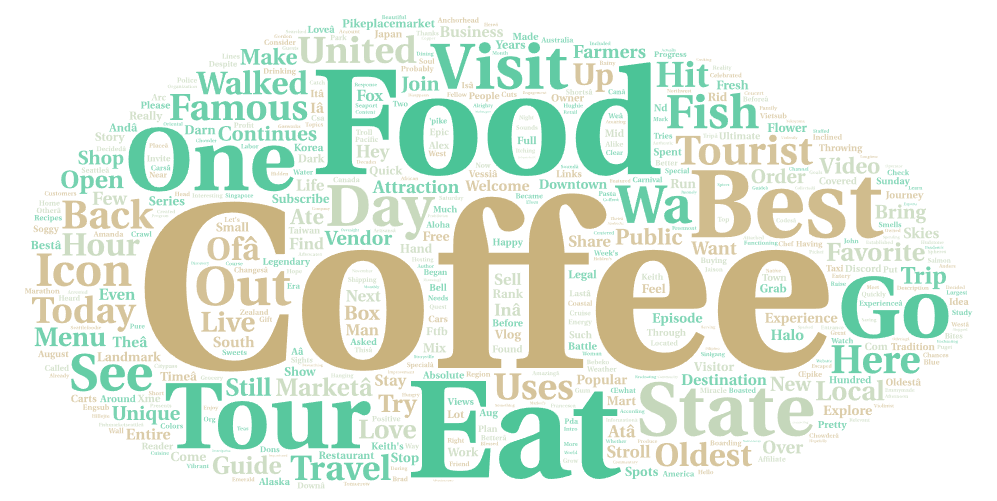
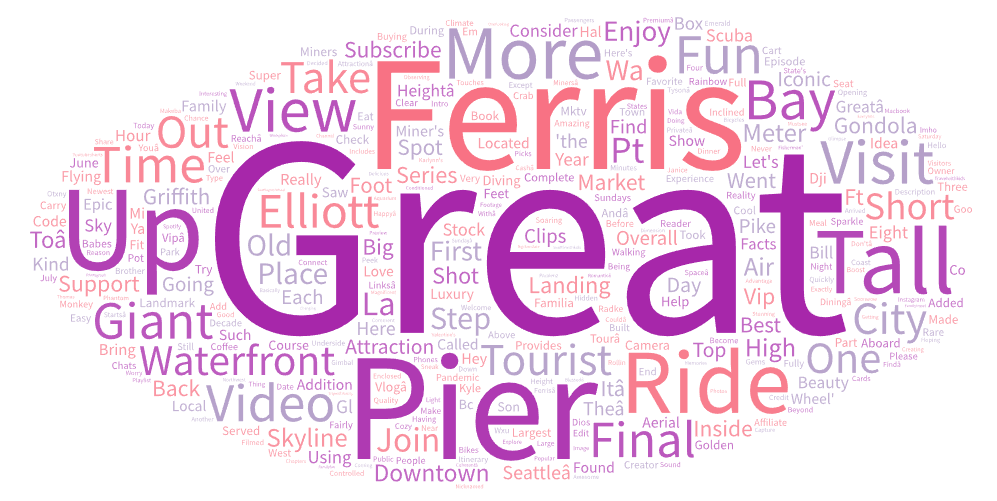

# GEOG458Lab2
# Analysis of Seattle Landmarks

This project explores YouTube videos about some famous Seattle landmarks: the Space Needle, Pike Place Market, and the Great Wheel. The reason for this comparison is to see how people are viewing Seattle's landmarks with similarities and differences. 

Personally, I've never visited any of these landmarks since I came here, and from this analysis, I could make my own plan for visiting these places. From what I observed, all of the three word clouds have unique characteristics of these places. For the Space Needle, it is New Year Firework and Icon; for Pike Place Market, it is food and coffee (referring to the first Starbucks); and for the Seattle Great Wheel, it is ferris and pier. 

One reason for these patterns is that I assume most of the videos on YouTube are made by visitors, instead of local residents. As a result, the word cloud is predictable as it has similar words compared to the data we can acquire online.

## Word Cloud Pics

## Suggestions for Future Research
While this analysis provides some interesting insights, there are several ways it could be improved in the future:
- Collect data over a longer period of time to capture changes in perceptions.
- Include more search terms to gather a wider range of videos.
- Analyze the comments on the videos to gain more insights into viewers' opinions.
- Consider other landmarks in Seattle or even expanding the research to include landmarks in other cities could provide a more comprehensive understanding of how landmarks are perceived and discussed online.
